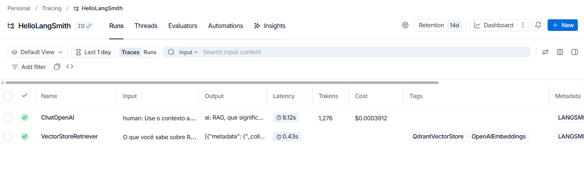
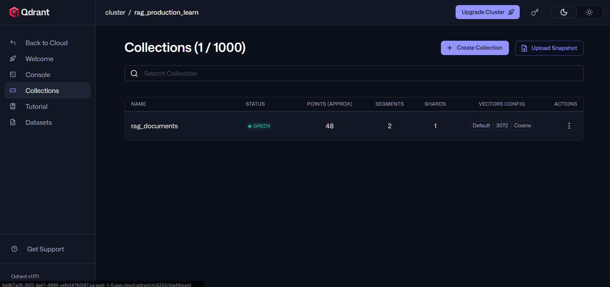
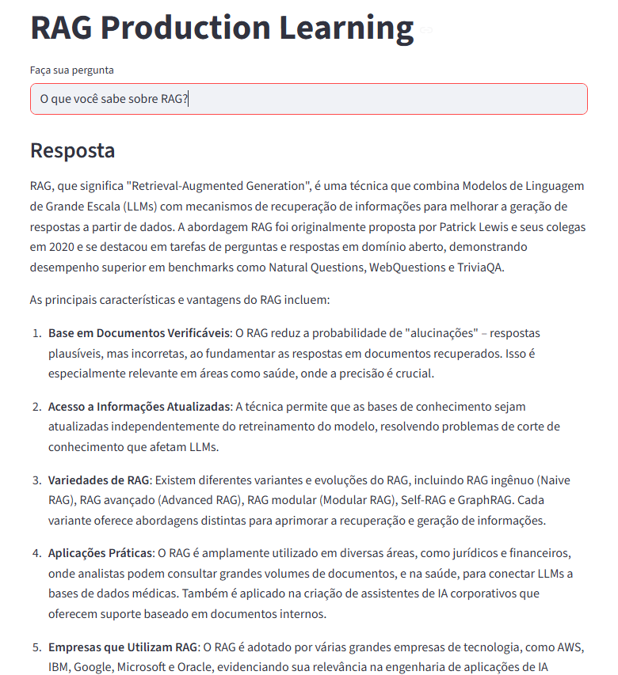
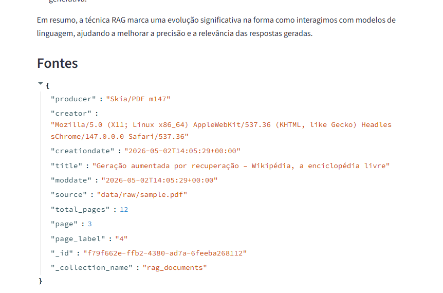

# rag-production-learning

Projeto de estudo para entender os componentes necessarios para levar um RAG
para producao.

## Objetivo

Este repositorio documenta uma primeira versao funcional de um fluxo RAG:

1. Carregar um PDF.
2. Quebrar o documento em chunks.
3. Gerar embeddings com OpenAI.
4. Persistir os vetores no Qdrant.
5. Recuperar trechos relevantes a partir de uma pergunta.
6. Enviar contexto recuperado para o modelo gerar a resposta.
7. Observar a execucao com traces no LangSmith.

## Como executar

Execute os comandos sempre a partir da raiz do projeto.

```powershell
python -m scripts.ingest_documents
```

Tambem funciona:

```powershell
python scripts/ingest_documents.py
```

```powershell
streamlit run app/streamlit_app.py
```

O primeiro formato e preferivel porque executa o script como modulo do projeto.

## Evidencias do fluxo

### Trace no LangSmith

O trace mostra as duas etapas principais da consulta:

- `VectorStoreRetriever`: recupera documentos relevantes no Qdrant.
- `ChatOpenAI`: recebe o contexto recuperado e gera a resposta final.



### Colecao no Qdrant

Depois da ingestao inicial, a colecao `rag_documents` aparece no Qdrant com
vetores densos de 3072 dimensoes, compativeis com o modelo
`text-embedding-3-large`.



### Primeira pergunta no app

Com o documento indexado, o app consegue responder uma pergunta usando o
conteudo recuperado do Qdrant.



### Fontes retornadas

A resposta tambem exibe os metadados dos documentos recuperados, incluindo o
arquivo de origem, pagina e nome da colecao.



## Pontos observados para producao

- Fixar explicitamente o modelo de embedding para evitar incompatibilidade de
  dimensoes na colecao vetorial.
- Manter a mesma colecao Qdrant apenas para embeddings com a mesma dimensao.
- Usar traces para inspecionar latencia, tokens, custo e chamadas internas.
- Exibir fontes/metadados para aumentar rastreabilidade da resposta.
- Executar scripts e app a partir da raiz do projeto ou garantir que a raiz
  esteja no `PYTHONPATH`.
